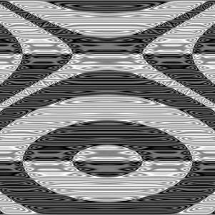

# Random Art Generator

This project makes randomly generated `.png` images. It creates an *expression*
for each color channel, which it then runs with the x and y coordinates of each image pixel to determine the pixel's final color.

## What's an expression?

I'm super-glad you asked! It takes an `x` and `y` value and returns a new
value between -1.0 and 1.0. It nests functions to create unexpected values.



This image was created with the following expression:

```py
sin(pi * sin(pi * sin(pi * (sin(pi * sin(pi * sin(pi * sin(pi *
    cos(pi * y))))) * cos(pi * sin(pi * cos(pi *
    avg(sin(pi * y), (x * x)))))))))
```

You can look at `random_art.py` and edit it in order to change the expression generation process.

## How to run this

This project uses [pipenv](https://pipenv.readthedocs.io/en/latest/). To use it, download the project and run `pipenv install`.

Run `create_art.py` (using `pipenv run` or after you run `pipenv shell`). `create_art.py` takes several command-line parameters you may want to use.

* `--seed SEED` sets the random seed to a particular number. This is great for
being able to generate the same image more than once.

* `-s SIZE` or `--size SIZE` sets the size of the image. `SIZE` is `{width}x{height}`, like `2560x1600`.

* `-n NUM` or `--number NUM` sets how many images to create. `NUM` is 1 by
default.

* `--gray`, `--rgb`, and `--cmyk` set whether the image is in grayscale or generated using RGB or CMYK values. RGB is the default.

## Credit

Modified from [a "nifty assignment" from the annual SIGCSE meeting](http://nifty.stanford.edu/2009/stone-random-art/).
